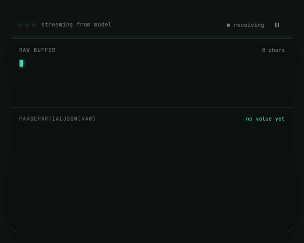
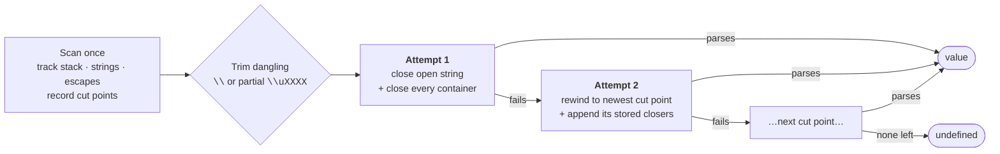

<p align="center">
  <a href="https://acegikmo135.github.io/sofar/">
    
  </a>
</p>

<h1 align="center">SoFar</h1>

<p align="center">
  <strong>Parse JSON while an LLM is still streaming it.</strong><br>
  Every prefix becomes the best value <em>so far</em> — on every chunk, in one pass, without ever throwing.
</p>

<p align="center">
  <a href="https://www.npmjs.com/package/sofar-json"></a>
  <a href="https://bundlephobia.com/package/sofar-json"></a>
  <a href="https://github.com/acegikmo135/sofar/actions/workflows/ci.yml"></a>
  
  
  <a href="LICENSE"></a>
</p>

<p align="center">
  <a href="https://acegikmo135.github.io/sofar/#demo"><b>Live playground</b></a> ·
  <a href="#quick-start">Quick start</a> ·
  <a href="#api">API</a> ·
  <a href="#how-it-works">How it works</a> ·
  <a href="#guarantees">Guarantees</a> ·
  <a href="#comparison">Comparison</a>
</p>

<br>

<p align="center">
  <a href="https://acegikmo135.github.io/sofar/"></a>
</p>

<br>

## The problem

When you stream structured output from a model, your handler sees the document one token at a time:

```
{"title": "Pad Th
{"title": "Pad Thai", "ingr
{"title": "Pad Thai", "ingredients": ["rice noo
```

`JSON.parse` throws on every one of those. So you either wait for the final `}` — and lose the entire point of streaming — or hand-roll a regex repair that breaks on the first escaped quote.

**SoFar** turns each prefix into the best value that can be honestly derived from it:

```ts
import { parsePartialJSON } from "sofar-json";

parsePartialJSON('{"title": "Pad Th');                                // { title: "Pad Th" }
parsePartialJSON('{"title": "Pad Thai", "ingr');                      // { title: "Pad Thai" }
parsePartialJSON('{"title": "Pad Thai", "ingredients": ["rice noo');  // { title: "Pad Thai", ingredients: ["rice noo"] }
```

It never invents structure that isn't in the buffer, and it never throws. You get a value or `undefined`.

<br>

## Why SoFar

| | |
|---|---|
| **425 bytes** | Gzipped, full ESM build. Smaller than most SVG icons. |
| **Zero dependencies** | Nothing but `JSON.parse`. Runs in Node 18+, Deno, Bun, browsers, and edge runtimes. |
| **Never throws** | Garbage in → `undefined` out. Wrap nothing in try/catch. |
| **Single pass, O(n)** | One scan, no backtracking rescans. ~1.3× the cost of a bare `JSON.parse` on a 1.6 MB buffer. |
| **Honest repairs** | A partial string is returned as a string. A partial number or literal falls back to the last known-good value — it never guesses. |
| **Two exports** | `parsePartialJSON` and `createJSONStream`. That's the whole API. Tree-shakes to one. |
| **Typed** | Strict TypeScript, bundled `.d.ts` / `.d.cts`, TSDoc on every export. |

<br>

## Quick start

```sh
npm install sofar-json
```

```ts
import { createJSONStream } from "sofar-json";

const stream = createJSONStream();

for await (const chunk of llmResponse) {
  const value = stream.feed(chunk);   // best-effort parse of everything so far
  if (value !== undefined) render(value);
}

JSON.parse(stream.raw);               // strict parse once the stream ends
```

That's it. Every `feed` returns a fresh, valid value — drop it straight into React state, a Vue ref, or a Svelte store.

<br>

## API

Two functions. Nothing else is exported at runtime.

### `parsePartialJSON(input: string): unknown`

Stateless, best-effort parse of a possibly-incomplete JSON string.

- Returns the parsed value if any usable prefix can be repaired.
- Returns `undefined` if nothing is parseable yet — empty input, whitespace, a bare `tru`.
- Never throws.
- A complete document parses identically to `JSON.parse`. A complete `null` returns `null`, not `undefined` — it's a real value.

```ts
parsePartialJSON('{"a": [1, 2, {"b": "c');   // { a: [1, 2, { b: "c" }] }
parsePartialJSON('{"a": 1,');                // { a: 1 }        trailing comma dropped
parsePartialJSON('{"ok": tru');              // {}              partial literal → last good value
parsePartialJSON('{"n": 1e+');               // {}              partial number  → last good value
parsePartialJSON('{"s": "caf\\u00e');        // { s: "caf" }    partial \u escape trimmed
parsePartialJSON('');                        // undefined
parsePartialJSON('null');                    // null
```

### `createJSONStream(): { feed(chunk: string): unknown; readonly raw: string }`

Stateful wrapper for the common case: chunks arrive, you want the current value after each one.

```ts
const stream = createJSONStream();

stream.feed('{"title": "Pad');        // { title: "Pad" }
stream.feed(' Thai", "servings"');    // { title: "Pad Thai" }
stream.feed(': 4}');                  // { title: "Pad Thai", servings: 4 }

stream.raw;                           // '{"title": "Pad Thai", "servings": 4}'
```

`raw` is the untouched concatenation of everything fed so far — useful for logging, retries, or a final strict parse.

<br>

## Examples

<details open>
<summary><b>fetch + ReadableStream</b></summary>

```ts
import { createJSONStream } from "sofar-json";

async function streamRecipe(prompt: string, onUpdate: (value: unknown) => void) {
  const res = await fetch("/api/recipe", { method: "POST", body: JSON.stringify({ prompt }) });

  const reader = res.body!.getReader();
  const decoder = new TextDecoder();
  const stream = createJSONStream();

  while (true) {
    const { done, value } = await reader.read();
    if (done) break;

    const parsed = stream.feed(decoder.decode(value, { stream: true }));
    if (parsed !== undefined) onUpdate(parsed);
  }

  return JSON.parse(stream.raw); // throws only if the model produced invalid JSON
}
```
</details>

<details>
<summary><b>OpenAI SDK</b></summary>

```ts
import OpenAI from "openai";
import { createJSONStream } from "sofar-json";

const openai = new OpenAI();
const stream = createJSONStream();

const completion = await openai.chat.completions.create({
  model: "gpt-4o",
  stream: true,
  response_format: { type: "json_object" },
  messages: [{ role: "user", content: "Give me a recipe as JSON." }],
});

for await (const part of completion) {
  const delta = part.choices[0]?.delta?.content;
  if (delta) render(stream.feed(delta));
}
```
</details>

<details>
<summary><b>Anthropic SDK</b></summary>

```ts
import Anthropic from "@anthropic-ai/sdk";
import { createJSONStream } from "sofar-json";

const client = new Anthropic();
const stream = createJSONStream();

const events = client.messages.stream({
  model: "claude-sonnet-5",
  max_tokens: 1024,
  messages: [{ role: "user", content: "Return a recipe as JSON only." }],
});

events.on("text", (delta) => render(stream.feed(delta)));
```
</details>

<details>
<summary><b>Vercel AI SDK</b></summary>

```ts
import { streamText } from "ai";
import { createJSONStream } from "sofar-json";

const { textStream } = await streamText({ model, prompt });
const stream = createJSONStream();

for await (const delta of textStream) {
  render(stream.feed(delta));
}
```
</details>

<details>
<summary><b>React</b></summary>

```tsx
import { useState } from "react";
import { createJSONStream } from "sofar-json";

function Recipe({ prompt }: { prompt: string }) {
  const [data, setData] = useState<unknown>();

  async function start() {
    const stream = createJSONStream();
    for await (const delta of fetchDeltas(prompt)) {
      const value = stream.feed(delta);
      if (value !== undefined) setData(value); // fresh object each call → re-render
    }
  }

  return <RecipeView data={data} onStart={start} />;
}
```
</details>

<details>
<summary><b>Vue · Svelte · anything else</b></summary>

The pattern never changes: feed each chunk, and when the result is not `undefined`, assign it wherever your state lives.

- **Vue** — `const data = shallowRef<unknown>()`, then `data.value = stream.feed(delta)`.
- **Svelte** — `let data = $state<unknown>()`, then `data = stream.feed(delta)`.
- **Solid / Angular / plain DOM** — one `feed` per chunk, one assignment per non-`undefined` result.

Because intermediate values are always valid JSON, the components that render the finished result render the partial one too. No separate loading shape.
</details>

<br>

## How it works

The buffer is scanned exactly once, left to right, tracking the stack of open containers and whether the cursor is inside a string. As it goes, the scanner records **safe cut points** — positions where the JSON so far is structurally coherent — each paired with a snapshot of the container stack at that moment.



1. **Trim the tail.** A dangling `\` or partial `\uXXXX` at the end of an open string is dropped, using the scanner's own escape state — so a string that legitimately ends in `\\` is left alone.
2. **Attempt 1 — close everything.** Close the open string if there is one, append the closers for every open `{` / `[`, `JSON.parse`. This resolves the vast majority of prefixes.
3. **Attempt 2 — rewind.** If that fails (a dangling key, a trailing comma, `tru`, `4.`), walk the cut points newest-first — right after a string closes, right after a container opens or closes, right before a structural comma — slice the buffer there, append that cut's stored closers, parse. First success wins.
4. **Otherwise `undefined`.** Never throw.

The stack snapshot is stored inline as the string of closers to append, so every rewind is a slice and a concat — never a rescan of the prefix. Everything stays O(n).

<br>

## Guarantees

Every case below has its own unit test, plus a fuzz test that feeds a full document one character at a time and asserts every intermediate parse either succeeds or returns `undefined` — never throws.

| Input | Output | Why |
|---|---|---|
| `{"title": "Hello wor` | `{"title":"Hello wor"}` | A prefix of a string is still a string |
| `{"path": "C:\` | `{"path":"C:"}` | Dangling escape dropped before closing |
| `{"path": "C:\\` | `{"path":"C:\\"}` | Escaped backslash is complete — kept |
| `{"s": "caf\u00e` | `{"s":"caf"}` | Partial `\u` sequence trimmed |
| `{"a": [1, {"b": [2, {"c": "de` | `{"a":[1,{"b":[2,{"c":"de"}]}]}` | Containers closed innermost-first |
| `{"title": "x", "ingr` | `{"title":"x"}` | Dangling key → last complete member |
| `{"title": "x", "ingredients":` | `{"title":"x"}` | Key with no value → same rewind |
| `{"a": 1,` | `{"a":1}` | Trailing comma dropped |
| `{"ok": tru` | `{}` | Partial literal → last good value |
| `[true, fals` | `[true]` | Earlier elements survive |
| `{"count": 42` | `{"count":42}` | Number cut mid-digit is still a number |
| `{"count": 4.` | `{}` | `4.` could become `4.5` — not guessed |
| `{"n": 1e+` | `{}` | Partial exponent → last good value |
| `[1, 2, -` | `[1,2]` | Bare minus is not a number yet |
| `` (empty) | `undefined` | Nothing parseable, no exception |
| `   ` | `undefined` | Whitespace only |
| `null` | `null` | A real value, not `undefined` |
| `}}}]]` | `undefined` | Garbage in, `undefined` out |

Also covered: 20+ levels of nesting, brackets and commas inside strings, escaped quotes, and a complete document round-tripping identically to `JSON.parse`.

<br>

## Comparison

Measured on 2026-09-18 with esbuild (`--bundle --minify`) + gzip -9, then probed with the same inputs.

| | **SoFar** | `partial-json` 0.1.7 | `best-effort-json-parser` 1.5.1 | `jsonrepair` 3.15.0 |
|---|:---:|:---:|:---:|:---:|
| Gzipped size | **425 B** | 1 611 B | 1 880 B | 3 681 B |
| Runtime dependencies | **0** | 0 | 0 | 0 |
| `''` (empty) | `undefined` | **throws** | `""` | **throws** |
| `}}}` (garbage) | `undefined` | **throws** | returns the string `"}}}"` | **throws** |
| `{"a": "caf\u00e` | `{a:"caf"}` | `{a:"caf"}` | **throws** | `{a:"caf"}` |
| `{"ok": tru` | `{}` — no guess | `{ok:true}` | `{ok:true}` | `{ok:"tru"}` |
| `{"title":"x","ingr` | `{title:"x"}` | `{title:"x"}` | `{title:"x"}` | `{title:"x",ingr:null}` — invented |
| Never throws | **✓** | – | – | – |
| Uses native `JSON.parse` | **✓** | custom parser | custom parser | custom parser |
| Fixes non-JSON syntax (quotes, comments) | – | – | – | **✓** |

SoFar repairs *truncation* and only ever returns what the buffer supports. If you need to repair *broken syntax* — unquoted keys, single quotes, comments — `jsonrepair` is the right tool, and the two chain cleanly.

<br>

## What it won't do

- **Fix JSON that was never going to be valid.** Unquoted keys, single quotes, `NaN`, comments. Use a lenient parser for that.
- **Guess at a partial number.** `{"count": 4.` returns `{}`, not `{ count: 4 }`, because `4.` could become `4.5`. Partial strings are returned as-is because a prefix of a string is still a string.
- **Stream out.** You get a full value on every call, not a diff. At LLM token rates this is a non-issue; for multi-megabyte documents, throttle `feed` to animation frames.

<br>

## Benchmarks

Node 24, single run, `parsePartialJSON` on a buffer of ~20 000 objects cut mid-document:

| Buffer | `parsePartialJSON` | bare `JSON.parse` (complete doc) |
|---|---:|---:|
| 413 kB | 41 ms | — |
| 825 kB | 77 ms | — |
| 1 651 kB | 92 ms | 68 ms |

The single scan plus one or two `JSON.parse` attempts lands within ~1.3× of the native parser on a complete document.

<br>

## Development

```sh
npm install
npm test            # vitest — 26 tests incl. fuzz
npm run typecheck   # tsc --noEmit
npm run build       # tsup → dist/ (ESM + CJS + .d.ts)
npm run size        # size-limit, 2 kB budget
npm run treeshake   # verifies createJSONStream is dropped when unused
npm run build:site  # regenerates site/index.html from site/page.html
```

CI runs all of the above on Node 18, 20 and 22, plus an `npm pack --dry-run` check that only `dist/`, `package.json`, `README.md` and `LICENSE` ship.

<br>

## Contributing

Issues and PRs are welcome. If you've hit a stream SoFar handles badly, the most useful thing you can send is the exact buffer as a string — it becomes a test case.

<br>

## License

MIT © 2026 Manthan Kansagra
